# 📝 Online Examination System

🚀 **Online Examination System** is a full-stack web application designed to conduct secure and scalable online exams.  
It supports **Admin and Student roles**, enabling efficient exam creation, real-time evaluation, and result management.

This project demonstrates real-world concepts like **authentication, database integration, role-based access, and dynamic UI**.

---

## 🌐 Live Demo

👉 https://online-exam-system-9q00.onrender.com

---

# 🖼️ Application Preview

---

## 🔐 Login Page
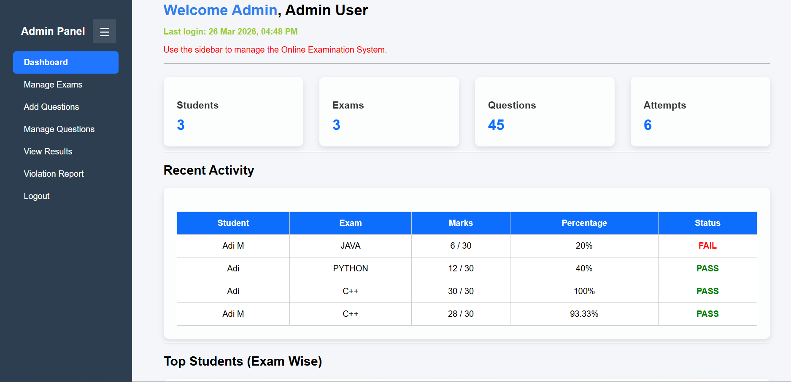

---

## 👑 Admin Dashboard
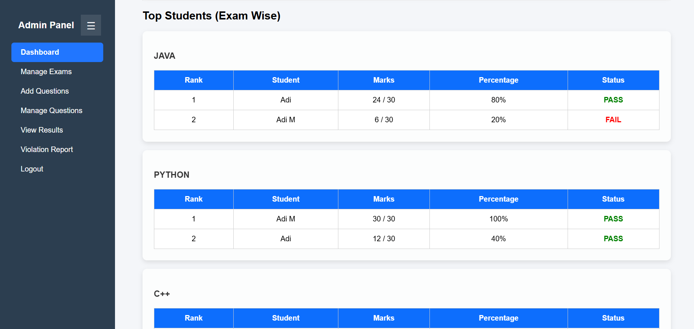

---

## 📝 Exam Management
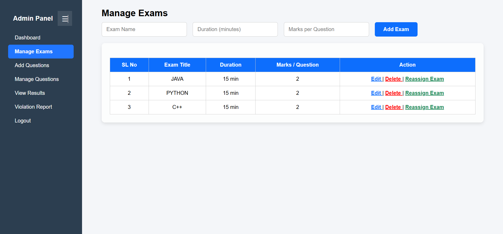

---

## ❓ Question Management
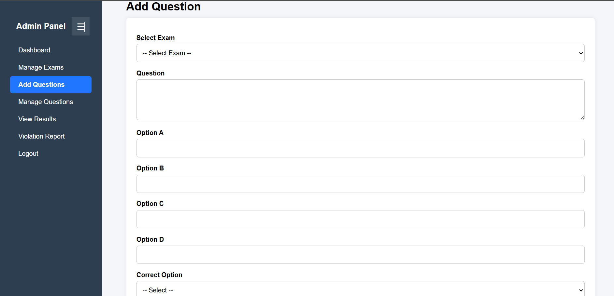

---

## 📊 Results Section
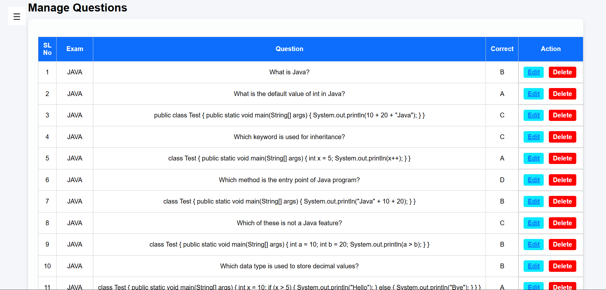

---

## 👨‍🎓 Student Dashboard
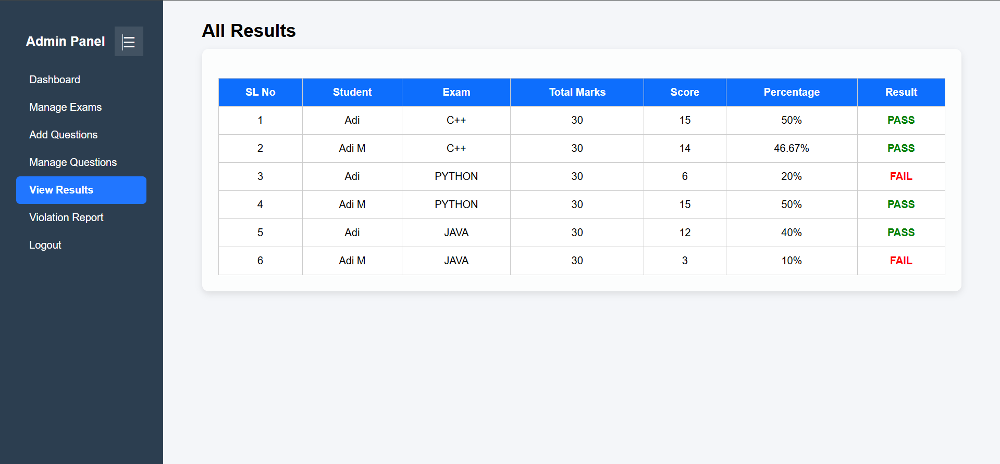

---

## 🧾 Exam Interface
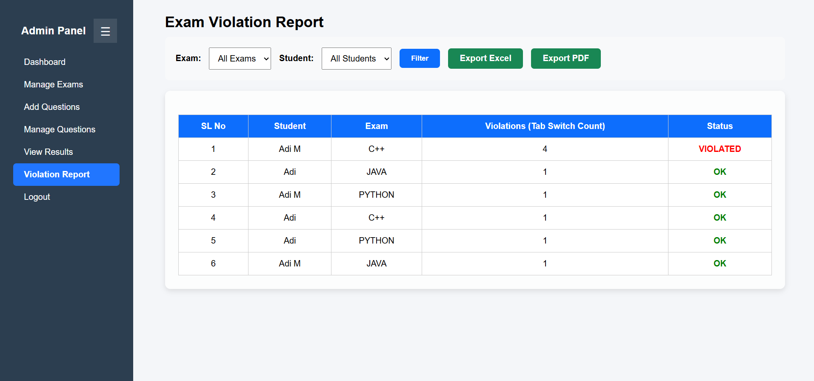

---

## 📈 Performance View
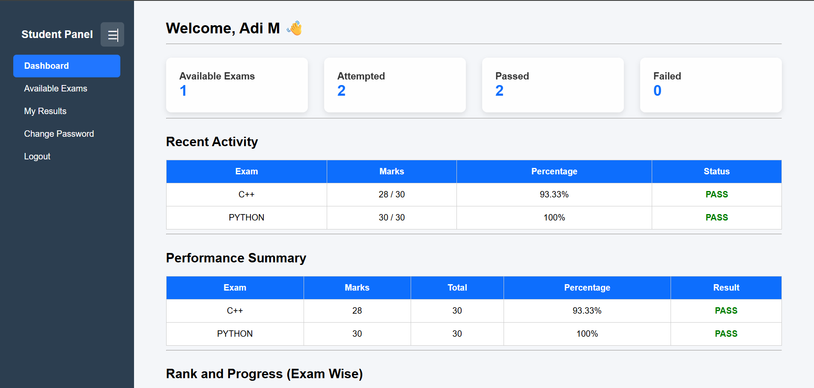

---

## 📄 Screen 9
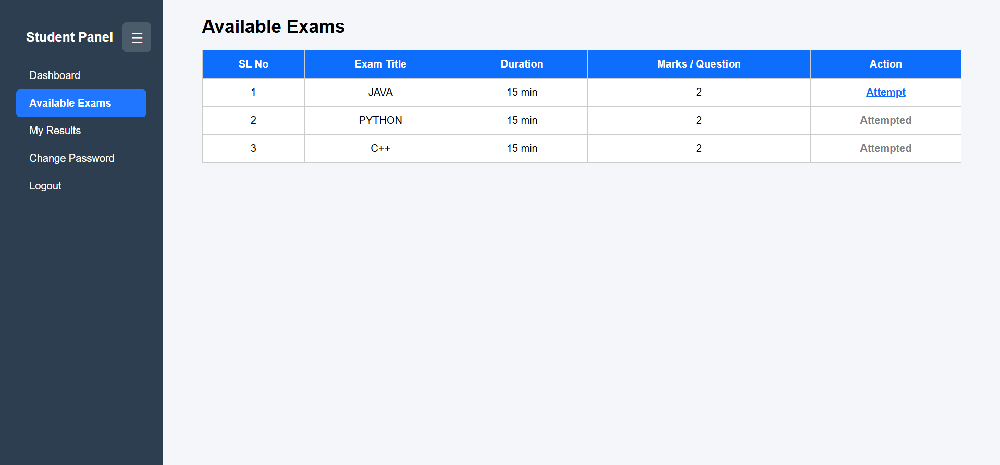

---

## 📄 Screen 10
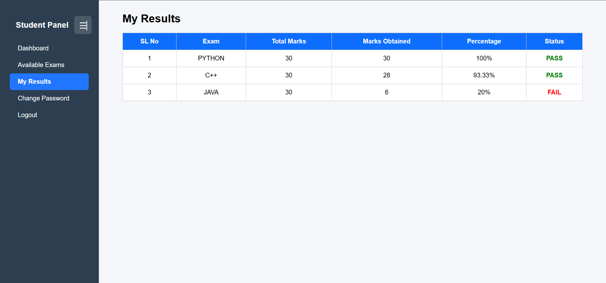

---

## 📄 Screen 11
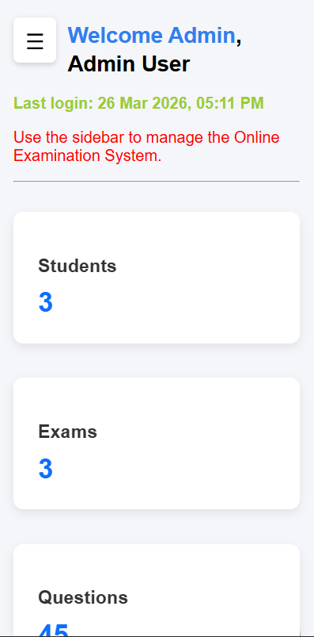

---

## 📄 Screen 12
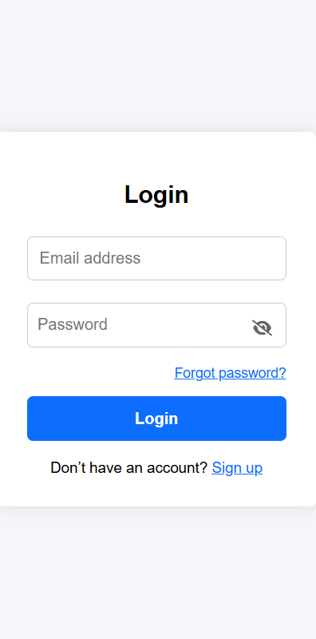

---

# ✨ Core Features

### 👤 Student Features
- 📝 Attempt online exams  
- ⏱ Timer-based tests  
- 📊 Instant results  
- 📈 Performance tracking  

---

### 👑 Admin Features
- 🧑‍💼 Create & manage exams  
- ❓ Manage questions  
- 📊 Monitor results  
- ⚙️ Full system control  

---

# 🔐 Authentication & Security

- Secure login system  
- Role-based access control  
- Session management  
- Input validation  

---

# 🧩 Technology Stack

### 💻 Frontend
- HTML  
- CSS  
- JavaScript  

### ⚙️ Backend
- PHP  

### 🗄️ Database
- MySQL (Railway Cloud Database)  

---

# ☁️ Deployment

- Hosted on **Render**  
- Database hosted on **Railway MySQL**  

---

# 📱 Key Highlights

- Responsive design  
- Clean UI  
- Real-time result generation  

---

# 🎯 Use Cases

- 🎓 Online exams  
- 🧪 Practice tests  
- 📊 Skill assessment  

---

# 🔮 Future Enhancements

- 📧 Email notifications  
- 🔐 OTP login  
- 📱 Mobile app  

---

# ⭐ Final Note

This project demonstrates a **complete online examination system** with real-world functionality.

✨ Feel free to explore and enhance!
