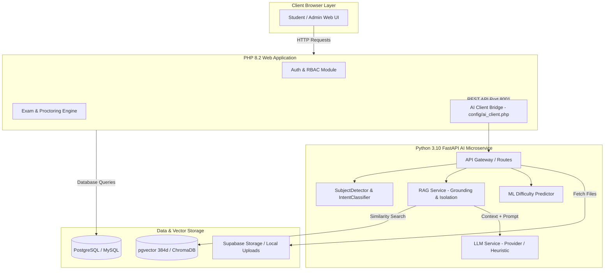
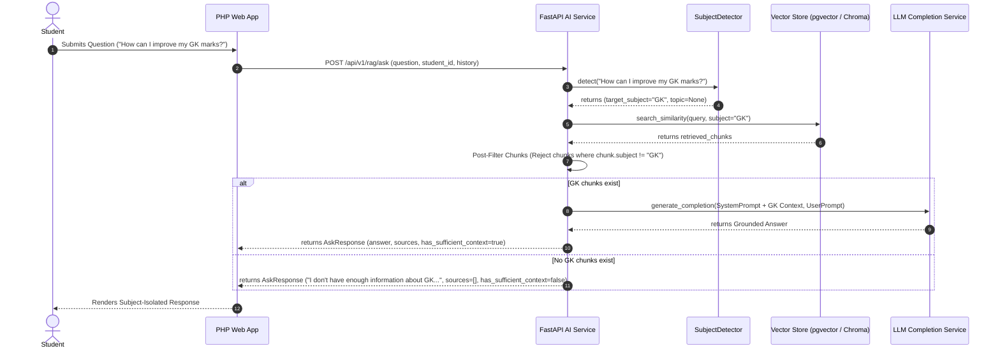

# AI-Powered Online Examination & Personalized Learning System

> A production-oriented Full-Stack Online Examination and AI Engineering Platform featuring secure exam proctoring, automated question generation, human-in-the-loop admin review, question-specific focused study notes, machine-learning question difficulty prediction, Retrieval-Augmented Generation (RAG) study assistance with strict subject isolation, student performance analytics, and personalized adaptive learning.

---

## 1. Project Overview

The **AI-Powered Online Examination & Personalized Learning System** combines a robust PHP 8.2 web management application with an asynchronous Python FastAPI AI microservice architecture. It provides an end-to-end platform for educational institutions to create, manage, and proctor online examinations, while empowering students with automated performance diagnostics, RAG-powered course material study assistance, and personalized adaptive practice sessions.

The system integrates AI engineering capabilities (including automated MCQ generation, human-in-the-loop admin staging queues, concept-specific study note generation, machine-learning question difficulty prediction, and Retrieval-Augmented Generation) while maintaining strict subject isolation and AI safety safeguards.

---

## 2. Objectives

- **Automated Question Generation & Human-in-the-Loop Review**: Streamline exam preparation by generating 4-option MCQs with explanations, staged for admin review before publication.
- **Concept-Specific Study Notes**: Provide focused study notes tailored to individual question concepts, explicitly flagging grounded versus ungrounded content.
- **Empirical Question Difficulty Prediction**: Analyze student interaction metrics using Scikit-Learn models with cold-start protections and statistical sample thresholds.
- **Deterministic Student Analytics**: Aggregate topic mastery percentages (`Strong`, `Developing`, `Weak`) and track score trajectories over time.
- **Grounded RAG Study Assistance**: Answer student queries using manually uploaded course materials (PDF, TXT, MD) with exact filename and page citations.
- **Strict Subject Isolation**: Eliminate cross-subject retrieval leakage (e.g., ensuring GK queries never retrieve English or Maths notes).
- **Cloud-Ready Architecture**: Design a decoupled system ready for deployment on Render and Supabase with PostgreSQL + `pgvector`.

---

## 3. AI Engineering Features

### A. AI Question Generation & Admin Review Queue
- **Parameter Inputs**: Administrators select target subject (*Operating Systems*, *English*, *Maths*, *GK*, *Computer Science*, *Database*), topic, difficulty (*easy*, *medium*, *hard*), and question count (1-10).
- **Automated MCQ Generation**: Generates 4-option multiple-choice questions with correct answer keys and academic explanations using LLM completions (`gpt-4o-mini`) or heuristic fallback.
- **Admin Review Queue**: Generated items enter `ai_generated_questions` with a `pending` status. In `admin/ai_question_review.php`, administrators inspect, approve (publishing to the active question bank), or reject items with feedback reasons.

### B. Question-Specific Focused Study Notes
- **Individual Question Scoping**: Generates focused study notes tailored specifically to the core concept tested by an individual question.
- **Grounded vs. Non-Grounded Execution**:
  - **Grounded Notes (`is_grounded: true`)**: Uses retrieved RAG chunks matching the question's subject and topic, attaching source metadata to `rag_sources`.
  - **Non-Grounded Fallback (`is_grounded: false`)**: When matching course material is unavailable, notes rely on LLM domain knowledge and are explicitly flagged as ungrounded.
- **Caching & Persistence**: Notes are saved in `question_study_notes` linked to `question_id`, `ai_question_id`, or `practice_answer_id`, preventing redundant LLM calls on subsequent views.

### C. Machine Learning Question Difficulty Analysis
- **Empirical Attempt Evaluation**: Feature extractor processes question text length, readability, option ambiguity, domain terminology, and historical attempt data (`total_attempts`, `correct_attempts`, `unique_students`, `topic_avg_accuracy`, `subject_avg_accuracy`).
- **Real-Attempt Threshold Rules**:
  - **Cold-Start Guard ($< 3$ attempts)**: Returns `status: "insufficient_real_data"` and falls back to teacher-assigned difficulty.
  - **Early Real-Data Inference ($3 - 29$ attempts)**: Computes early predictions (`data_mode: "real_data_production"`), tagged with a low sample size disclaimer.
  - **Sample Threshold Met ($\ge 30$ attempts)**: Provides statistical predictions (`data_mode: "real_data_production"`) meeting robust sample criteria.
- **Synthetic Benchmark Validation Framing**: The 99.17% Random Forest accuracy achieved on synthetic benchmark data is explicitly labeled as **pipeline validation performance**, NOT real-world production model accuracy (due to target-feature leakage in synthetic label construction).
- **Human Oversight**: Machine learning predictions require manual administrator confirmation in `admin/ai_difficulty_analytics.php` before updating active question difficulty.

### D. Deterministic Student Performance Analytics
- **Metric Aggregation**: Computes overall accuracy percentages, average exam scores, and topic-level mastery.
- **Mastery Categorization**:
  - **`Strong`**: Topic accuracy $\ge 80.0\%$
  - **`Developing`**: Topic accuracy between $50.0\%$ and $79.99\%$
  - **`Weak`**: Topic accuracy $< 50.0\%$
- **Trend Trajectory**: Measures percentage point changes across consecutive exams (`improving`, `declining`, `stable`, `insufficient_data`).

### E. Personalized Learning & Adaptive Practice
- **Weakness Priority Ranking**: Deterministically ranks student topics based on weakness ($< 60\%$ accuracy or lowest scoring area).
- **Targeted Practice Sessions**: Students launch practice sessions focused on identified weak topics, stored separately in `ai_practice_sessions` and `ai_practice_answers` without affecting official exam grades.

### F. RAG-Based AI Study Assistant
- **Manual Document Processing**: Administrators upload PDF, TXT, or MD course materials under a specific subject and topic in `admin/manage_course_materials.php`.
- **Text Parsing & Chunking**: `DocumentLoader` extracts text and `TextChunker` creates deterministic text chunks with metadata (`document_id`, `filename`, `subject`, `topic`, `page_number`).
- **Dense Vector Embedding**: Generates 384-dimensional dense vectors using `sentence-transformers` (`BAAI/bge-small-en-v1.5`) or `fastembed`.
- **Vector Storage**: Persists embeddings in PostgreSQL with `pgvector` (`ai_document_chunks`) or local `ChromaDB`.
- **Grounded Answering & Citations**: Answers student questions using retrieved context blocks with exact filename and page citations.

### G. Subject-Isolated AI Retrieval & Mode Branching
- **Subject Detection & Normalization**: `SubjectDetector` extracts target subjects (`GK`, `English`, `Maths`, `Operating Systems`, `Computer Science`, `Database`) from user queries and normalizes variants.
- **Mode A — Subject-Specific Queries** (e.g., *"How can I improve my GK marks?"*):
  - Performance analytics, vector retrieval, chunk validation, citations, and prompt instructions are **strictly scoped** to `target_subject`.
  - **No Cross-Subject Leakage**: Prevents unrelated documents (e.g., English Grammar PDFs) or unrelated performance stats (e.g., Maths Differentiation scores) from appearing in a GK response.
  - **No Cross-Subject Fallback**: If no course material exists for the requested subject, the assistant explicitly reports:
    > *"I don't have enough information about GK in the uploaded course materials yet. You can upload GK notes under Subject = GK to enable grounded recommendations."*
- **Mode B — General Queries** (e.g., *"Which subject should I improve?"*):
  - Analyzes overall performance history across all subjects to identify the student's weakest area.

### H. AI Safety Safeguards
- **Intent Classification**: Separates conversational, identity, and admin requests from academic RAG queries (`IntentClassifier`).
- **Prompt Injection Defense**: Encapsulates context blocks as untrusted user data with strict system prompt boundaries.
- **Grounding Indicators**: Includes explicit `is_grounded` and `has_sufficient_context` boolean flags in API responses.
- **Source Validation**: Verifies chunk metadata against requested subject prior to display, preventing fabricated citations.

---

## 4. User Roles

### Administrator Role
- **Exam & Question Management**: Create, edit, and publish online exams and manual MCQ question banks.
- **AI Question Review Queue**: Generate AI questions, inspect pending items, approve valid questions, or reject items with notes.
- **Course Material Management**: Upload PDF, TXT, or MD study materials assigned to a subject and topic to expand the grounded RAG knowledge base.
- **ML Difficulty Review**: Inspect empirical difficulty predictions in `admin/ai_difficulty_analytics.php` and apply confirmed updates.
- **Proctoring Audit**: Review student tab-switch count reports and auto-submitted violation logs.

### Student Role
- **Online Examination**: Take assigned timed exams with tab-switch proctoring enforcement and view instant score reports.
- **RAG AI Study Assistant**: Interact with the AI assistant in `student/study_assistant.php` for subject performance insights and grounded study answers.
- **Adaptive Practice**: Launch custom practice quizzes focused on weak subjects and topics.
- **Focused Study Notes**: View AI-generated study notes tailored to specific question concepts directly from practice sessions.

---

## 5. System Architecture



---

## 6. RAG Architecture



---

## 7. Technology Stack

- **Web Frontend**: HTML5, Vanilla CSS3 (Custom Design Tokens), JavaScript (Fetch API, AJAX)
- **Web Core Backend**: PHP 8.2 (Apache, PDO, MySQLi, PostgreSQL extension)
- **AI Microservice**: Python 3.10, FastAPI, Uvicorn, Pydantic v2, HTTPX
- **Machine Learning & NLP**: Scikit-Learn (Random Forest, Logistic Regression), NumPy, Joblib
- **RAG & Embeddings**: PyPDF, `sentence-transformers` (`BAAI/bge-small-en-v1.5`), `fastembed`, PostgreSQL `pgvector`, ChromaDB
- **Databases**: PostgreSQL 15 (Supabase) / MySQL 8.0 (Local XAMPP)
- **Infrastructure**: Docker, Docker Compose, Render Blueprint (`render.yaml`)

---

## 8. Project Structure

```
online-exam-system/
├── admin/                        # Admin Portal (Exams, AI Review, Course Materials, ML Difficulty)
├── ai-service/                   # Python FastAPI AI Microservice
│   ├── app/
│   │   ├── config.py             # Service Settings & Environment Variables
│   │   ├── main.py               # FastAPI Application Entrypoint
│   │   ├── ml/                   # Machine Learning Model Artifacts & Feature Extractor
│   │   ├── routes/               # API Endpoint Routers (RAG, ML, Question Gen, Performance)
│   │   ├── schemas/              # Pydantic Data Validation Schemas
│   │   └── services/             # Core Business Logic (RAGService, SubjectDetector, LLMService)
│   ├── Dockerfile                # AI Service Container Definition
│   ├── requirements.txt          # Python Package Dependencies
│   └── tests/                    # Pytest Suite (40 Unit & Integration Tests)
├── config/                       # PHP Database & AI Client Configuration
│   ├── ai_client.php             # Guzzle/Curl HTTP Bridge to FastAPI Service
│   └── db.php                    # Database Connection Handler (PDO / MySQLi)
├── database/                     # SQL Schemas & Migrations
│   ├── migrations/               # Non-destructive Database Migrations (004_question_study_notes.sql)
│   └── schema_postgres.sql       # PostgreSQL + pgvector Schema Definition
├── docs/                         # Architecture & Verification Documentation
├── student/                      # Student Portal (Exams, RAG Assistant, Adaptive Practice)
├── tests/                        # PHP Test Suites (Client, Focused Notes, Regression)
├── Dockerfile                    # PHP Application Container Definition
├── docker-compose.yml            # Multi-Container Development Orchestration
├── render.yaml                   # Render Blueprint Infrastructure-as-Code
└── README.md                     # Project Documentation
```

---

## 9. Database Architecture

The database schema is defined in [`database/schema_postgres.sql`](file:///c:/xampp/htdocs/exam-online/online-exam-system/database/schema_postgres.sql) and [`database/migrations/004_question_study_notes.sql`](file:///c:/xampp/htdocs/exam-online/online-exam-system/database/migrations/004_question_study_notes.sql).

### Table Groups

```
Core Examination Tables
├── users                     (id, name, email, password, role, reset_token)
├── exams                     (id, title, duration, total_marks, ai_generated)
├── questions                 (id, exam_id, question, option_a..d, correct_option, subject, topic, difficulty)
├── results                   (id, user_id, exam_id, score, tab_switch_count, taken_at)
├── student_answers           (id, student_id, exam_id, question_id, answer)
└── violations / report       (id, user_id, exam_id, violation_count)

AI Feature Tables
├── ai_generation_requests    (id, request_id, admin_id, subject, topic, difficulty, number_requested)
├── ai_generated_questions    (id, request_id, question, option_a..d, correct_option, status, rejection_reason)
├── question_study_notes      (id, question_id, ai_question_id, practice_answer_id, concept_title, notes_content, rag_sources, is_grounded)
├── ai_practice_sessions      (id, student_id, subject, topic, difficulty, score, status)
└── ai_practice_answers       (id, session_id, student_id, question_text, option_a..d, correct_option, student_answer, is_correct)

RAG Vector Tables
├── ai_documents              (id, filename, file_path, subject, topic, total_pages, total_chunks, status)
└── ai_document_chunks        (id, document_id, chunk_index, page_number, chunk_text, embedding vector(384))
```

---

## 10. AI Service Architecture

The FastAPI microservice exposes the following REST API endpoints:

| Method | Endpoint | Description |
| :--- | :--- | :--- |
| `GET` | `/health` | Service healthcheck endpoint |
| `POST` | `/api/v1/questions/generate` | Generates AI MCQs with answer keys and explanations |
| `POST` | `/api/v1/questions/focused-notes` | Generates concept-specific study notes for an individual question |
| `POST` | `/api/v1/ml/question-difficulty` | Evaluates empirical question difficulty using ML classifiers |
| `POST` | `/api/v1/performance/analyze` | Calculates student performance metrics, mastery classes, and trends |
| `POST` | `/api/v1/recommendations/plan` | Generates personalized study plans and adaptive practice recommendations |
| `POST` | `/api/v1/rag/ingest` | Parses, chunks, embeds, and indexes uploaded course materials |
| `POST` | `/api/v1/rag/search` | Similarity search over vector index with subject/topic filtering |
| `POST` | `/api/v1/rag/ask` | Subject-isolated RAG pipeline for student study assistant queries |

---

## 11. Security

- **Database Security**: Prepared SQL statements (`$conn->prepare()`, `$stmt->bind_param()`, `psycopg2`) enforced across all database queries.
- **Authentication & RBAC**: Session authorization checks on all student and administrator endpoints.
- **CSRF Defense**: Session-bound CSRF tokens validated on state-changing POST operations.
- **Prompt Injection Protection**: Context blocks are encapsulated as untrusted user data in prompt construction.
- **Secret Safety**: Secrets, API keys, database credentials, and `.env` files are excluded via `.gitignore` and **never** tracked in Git repositories.

---

## 12. Testing

### Test Suite Execution Results

All automated test suites pass with 0 failures:

```bash
# 1. Python Pytest Suite (40 passed, 0 failed)
cd ai-service
.\.venv\Scripts\python.exe -m pytest tests -v

# 2. PHP AI Client Connectivity Test Suite (3 passed, 0 failed)
C:\xampp\php\php.exe tests/test_ai_client.php

# 3. PHP AI Question-Specific Focused Notes Test Suite (4 passed, 0 failed)
C:\xampp\php\php.exe tests/test_ai_focused_notes.php

# 4. PHP Core System Regression Test Suite (5 passed, 0 failed)
C:\xampp\php\php.exe tests/test_regression.php
```

### Verification Summary

| Test Suite | Scope | Result |
| :--- | :--- | :---: |
| **Pytest AI Microservice Suite** | RAG, Subject Isolation, Intent Classification, ML Difficulty, Focused Notes | **40 / 40 Passed** |
| **PHP AI Client Connectivity** | API Health, Payload Serialization, Error Handling | **3 / 3 Passed** |
| **PHP Focused Notes Integration** | DB Schema Migration 004, Notes Generation & Fallback | **4 / 4 Passed** |
| **PHP Core Regression** | Users, Exams, Questions, Results, Violations Integrity | **5 / 5 Passed** |
| **Live HTTP Subject Isolation** | Live E2E test of GK, English Grammar, and General queries | **100% Verified** |

---

## 13. Deployment

The application is configured for free-tier cloud deployment using Render and Supabase:

- **PHP Web Application**: Deployed as a Render Web Service using root [`Dockerfile`](file:///c:/xampp/htdocs/exam-online/online-exam-system/Dockerfile).
- **FastAPI AI Microservice**: Deployed as a Render Web Service using [`ai-service/Dockerfile`](file:///c:/xampp/htdocs/exam-online/online-exam-system/ai-service/Dockerfile).
- **Database**: Managed PostgreSQL 15 on Supabase with the `pgvector` extension enabled.
- **Storage**: Supabase Storage (`course-materials` bucket) for uploaded course files.
- **Infrastructure-as-Code**: Render Blueprint file ([`render.yaml`](file:///c:/xampp/htdocs/exam-online/online-exam-system/render.yaml)) orchestrates service environments and variables.

---

## 14. Current Limitations

- **Render Free Tier Spin-Down**: Render free web services automatically spin down after 15 minutes of inactivity, resulting in a 30–50 second cold-start delay on initial requests.
- **Vector Store Backend Configuration**: Local development uses local ChromaDB or PostgreSQL; cloud production uses Supabase PostgreSQL + `pgvector`.
- **Synthetic ML Benchmark Framing**: The 99.17% ML difficulty model accuracy was measured on synthetic dataset validation. Production retraining requires live interaction data ($\ge 30$ attempts per question across $\ge 50$ distinct students).

---

## 15. Why This Project Is Different

- **Deep AI Integration**: Combines RAG, machine learning, adaptive practice, and AI question generation within a functional online examination platform.
- **Strict Subject Isolation**: Enforces hard retrieval boundaries preventing cross-subject RAG hallucination or performance stats leakage.
- **Human-in-the-Loop Control**: All AI-generated questions and ML difficulty predictions require explicit administrator review before production database updates.
- **Production-Grade Security**: Enforces prepared statements, RBAC, CSRF defense, prompt injection safeguards, and transparent grounding flags throughout.

---

## 16. Recommended Screenshots

Future documentation updates should include screenshots for the following paths:

- `docs/images/project-overview.png`
- `docs/images/ai-question-generation.png`
- `docs/images/ai-question-review.png`
- `docs/images/ml-difficulty-analytics.png`
- `docs/images/rag-course-materials.png`
- `docs/images/ai-study-assistant.png`
- `docs/images/subject-isolation.png`
- `docs/images/personalized-learning.png`

---

## 17. Author

- **Developer**: Adiveppa D Mamadapur
- **Repository**: AI-Powered Online Examination & Personalized Learning System
