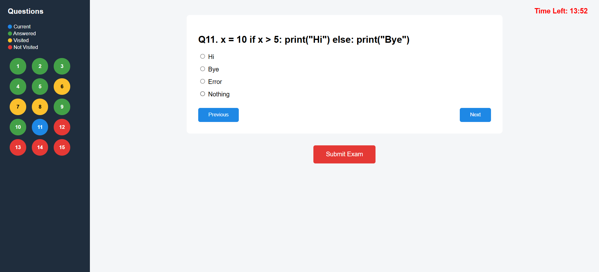

# AI-Powered Online Examination & Personalized Learning System

> A production-oriented Full-Stack Online Examination and AI Engineering Platform featuring secure exam proctoring, automated question generation, deterministic performance analytics, machine-learning question difficulty prediction, Retrieval-Augmented Generation (RAG) study assistance, and adaptive personalized recommendations.

---

## 🌟 Executive Overview & Live Demo

The **Online Examination & AI Learning Platform** combines a robust PHP 8.1 / MySQL exam management core with an asynchronous Python FastAPI AI microservice architecture. It provides an end-to-end environment for educators to manage exams and AI-generated question banks, while empowering students with automated performance diagnostics, RAG-powered course material study assistance, and personalized adaptive practice sessions.

- **Live Demo**: [https://online-exam-system-9q00.onrender.com](https://online-exam-system-9q00.onrender.com)

---

## 🖼️ Application Interface & Screenshots

### Admin Portal
- **Admin Dashboard**: Comprehensive overview of system stats, active exams, and user registrations.
  
- **Exam Management**: Interface for creating, configuring, and publishing online exams.
  
- **Add New Question**: Interface for adding manual MCQs with options and correct answers.
  
- **Question Bank Management**: Manage, edit, and organize question banks across subjects and topics.
  
- **Results & Analytics Section**: View overall student scores and performance metrics.
  
- **Exam Violation Report**: Track student proctoring violations, tab switches, and security warnings.
  

### Student Portal
- **Student Dashboard**: Personalized dashboard showing active exams, recent scores, and learning progress.
  
- **Available Exams**: Browse and enter assigned online examinations.
  
- **Interactive Exam Player**: Timer-driven exam interface with option selection and automated submission.
  
- **Individual Result Section**: Detailed score breakdown, correct answer review, and performance summaries.
  

---

## ✨ Key Features & System Modules

### 1. Core Examination Engine (PHP 8.1 & MySQL)
- **Authentication & Role-Based Access Control (RBAC)**: Secure admin and student session isolation.
- **Timer-Based Exam Execution**: Strict duration limits and automated server-side time tracking.
- **Proctoring & Violation Tracking**: Real-time detection of tab switches and window blur events logged to `violations` table.
- **Server-Side Scoring**: Immediate, secure calculation of exam results stored in MySQL database.

### 2. AI Question Generator (Phase D)
- **Automated MCQ Generation**: Generates 4-option multiple-choice questions with full explanations based on subject, topic, and difficulty.
- **Admin Staging & Review Workflow**: AI questions are routed to `ai_generated_questions` for human-in-the-loop admin approval or rejection prior to active question bank publication.

### 3. Student Performance Analytics (Phase E)
- **Deterministic Topic Analytics**: Aggregates question-level accuracy into student topic-level mastery percentages.
- **Mastery Classification**: Categorizes student topics into `STRONG` ($\ge 75\%$), `DEVELOPING` ($50\% - 74\%$), and `WEAK` ($< 50\%$).
- **Trend Calculation**: Tracks performance trajectory percentage points over time (`improving`, `stable`, `declining`).

### 4. Machine Learning Question Difficulty Prediction (Phase F)
- **Scikit-Learn Predictive Model**: Uses Random Forest and Logistic Regression classifiers trained on question attempt metrics (`correct_rate`, `attempt_count`, `option_distribution_entropy`).
- **Cold-Start Guard**: Questions with $< 5$ real student attempts return `status: "insufficient_real_data"` and fall back to assigned difficulty.
- **Human Oversight**: Predictions require manual admin confirmation in `admin/ai_difficulty_analytics.php` before database update.

### 5. Course Material RAG Study Assistant (Phase G)
- **Document Ingestion & Text Chunking**: Extracts text from PDF and TXT course materials using `pypdf` into deterministic 500-character chunks with 50-character overlap.
- **Semantic Vector Storage**: Embeds text using `sentence-transformers/all-MiniLM-L6-v2` (**384-dimensional embeddings**) into a persistent local `ChromaDB` vector index.
- **Grounded Answering & Source Citations**: Synthesizes contextual answers with strict page and filename metadata citations (`DBMS_Unit_3.txt, Page 1`).
- **Out-of-Domain Refusal**: Refuses queries lacking relevant context with an explicit fallback banner instead of hallucinating.

### 6. Personalized Adaptive Learning Engine (Phase H)
- **Bounded Priority Scoring**: Deterministically ranks student topics ($[0.0, 1.0]$) based on weakness ($50\%$), declining trend ($30\%$), and recency ($20\%$).
- **Personalized Study Plans**: Generates customized study schedules integrated with RAG course material citations.
- **Targeted Practice Sessions**: Creates custom practice quizzes stored in isolated tables (`ai_practice_sessions`, `ai_practice_answers`), strictly separate from official exam results.

---

## 🏗️ System Architecture

```
Student / Admin Browser
       │
       ▼
PHP Application (Apache / XAMPP) ──► MySQL Database (MariaDB 10.6)
       │
       ▼ (cURL REST API / Port 8001)
Python FastAPI Microservice (ai-service)
       ├─► Question Generator (LLM / Heuristic Engine)
       ├─► ML Difficulty Predictor (Random Forest / Joblib)
       ├─► RAG Service (pypdf, sentence-transformers [384d], ChromaDB)
       └─► Adaptive Recommendation Engine (Priority Scoring)
```

---

## 💻 Tech Stack

- **Frontend**: HTML5, CSS3 (Vanilla Responsive Styling), JavaScript (AJAX & Event Listeners)
- **Backend Core**: PHP 8.1 / 8.2 (Apache / XAMPP)
- **AI Microservice**: Python 3.10, FastAPI, Uvicorn, Pydantic v2, HTTPX
- **Machine Learning & Data**: Scikit-Learn, NumPy, Joblib
- **RAG & Vector Search**: ChromaDB, Sentence-Transformers (`all-MiniLM-L6-v2`), PyPDF
- **Databases**: MySQL / MariaDB 10.6 (XAMPP / Docker / Railway)
- **Containerization & CI**: Docker, Docker Compose, GitHub Actions

---

## 🚀 Environment Setup & Installation

### Option A: Standard Local Setup (XAMPP + Python Virtual Environment)

1. **Clone Repository & Configure XAMPP**:
   - Clone into your XAMPP web root (`c:\xampp\htdocs\exam-online\online-exam-system`).
   - Start Apache and MySQL in XAMPP Control Panel.
2. **Execute Database Migrations**:
   ```bash
   C:\xampp\php\php.exe database/run_migrations.php
   ```
3. **Setup and Launch FastAPI AI Microservice**:
   ```bash
   cd ai-service
   python -m venv .venv
   .\.venv\Scripts\activate
   pip install -r requirements.txt
   python -m uvicorn app.main:app --host 127.0.0.1 --port 8001
   ```
4. **Access Web Portal**:
   - Open browser: `http://localhost/exam-online/online-exam-system/`

---

### Option B: Docker Container Orchestration

Deploy the complete multi-container stack with Docker Compose:

```bash
docker compose build
docker compose up -d
```

- **PHP Web Service**: `http://localhost:8080`
- **FastAPI AI Service**: `http://localhost:8001`
- **MySQL Service**: `localhost:3306`

---

## 🧪 Testing & Evaluation

### Automated Test Suites
Run unit, integration, and regression test suites across Python and PHP:

```bash
# Python Pytest Suite (23 unit & integration tests)
cd ai-service
python -m pytest -v

# Offline Quality Evaluation Benchmarks
python tests/evaluate_rag.py
python tests/evaluate_recommendations.py

# PHP Integration & Core Regression Suite (30 integration tests + 9 E2E steps)
C:\xampp\php\php.exe tests/test_ai_client.php
C:\xampp\php\php.exe tests/test_ai_question_gen.php
C:\xampp\php\php.exe tests/test_ai_performance.php
C:\xampp\php\php.exe tests/test_ai_difficulty.php
C:\xampp\php\php.exe tests/test_ai_rag.php
C:\xampp\php\php.exe tests/test_ai_recommendations.php
C:\xampp\php\php.exe tests/test_regression.php
C:\xampp\php\php.exe tests/manual_e2e_verification.php
```

---

## 📊 Evaluation Results & Benchmark Summary

| Benchmark Suite | Test Type / Scope | Benchmark Score | Status / Label |
| :--- | :--- | :---: | :---: |
| **Pytest Unit & API Suite** | Service & API Endpoints | **100.0%** (23/23) | **PASSED** |
| **PHP Integration Suite** | End-to-End Core & AI Client | **100.0%** (30/30) | **PASSED** |
| **RAG Retrieval & Grounding** | Recall@3, Citations, Refusal | **100.0%** (3/3) | **DEVELOPMENT BENCHMARK** |
| **Adaptive Recommendation** | Profile Priority & Progression | **100.0%** (8/8) | **DEVELOPMENT BENCHMARK** |
| **ML Difficulty Classifier** | Synthetic Pipeline Validation | **99.17%** (Random Forest) | **SYNTHETIC BENCHMARK** |

---

## 🔬 Scientific Caveats & Known Limitations

1. **ML Difficulty Synthetic Benchmark Disclaimer**:
   - The **99.17% Random Forest accuracy** was measured on synthetic dataset validation.
   - **Target-Feature Leakage**: Labels $Y \in \{\text{easy}, \text{medium}, \text{hard}\}$ were constructed directly from student `correct_rate` thresholds ($>= 0.75 \rightarrow \text{easy}$, $< 0.45 \rightarrow \text{hard}$). Tree-based classifiers memorized these splits. This score **must not** be represented as real-world production model accuracy.
2. **Cold Start Limitation**:
   - Questions with $< 5$ real student attempts trigger the cold-start guard (`status: "insufficient_real_data"`) and fall back to teacher-assigned difficulty. Real-world retraining requires $\ge 30$ attempts across $\ge 50$ distinct students.
3. **RAG & Recommendation Evaluation Framing**:
   - RAG and Recommendation evaluation metrics represent **offline development quality benchmarks**, validating pipeline rules and out-of-domain refusal, not production-wide human user satisfaction.
4. **Vector Embedding Model**:
   - `sentence-transformers/all-MiniLM-L6-v2` produces **384-dimensional dense vectors** used for L2-normalized cosine distance searches in ChromaDB.

---

## 🛡️ Security, Privacy & CI/CD

- **Database Security**: Prepared SQL statements (`$conn->prepare()`, `$stmt->bind_param()`) used exclusively throughout PHP and Python components.
- **XSS & Output Sanitization**: HTML output escaped using `htmlspecialchars()`.
- **CSRF Defense**: Unique session-bound CSRF tokens validated on all sensitive POST forms.
- **Prompt Injection Isolation**: User document text is encapsulated in prompt context blocks to prevent instruction hijacking.
- **CI/CD Automation**: `.github/workflows/ci.yml` runs full Pytest, RAG, Recommendation, and PHP migration pipelines using local heuristic mock modes (`LLM_PROVIDER: heuristic`) requiring zero external paid API keys.

---

## 📑 Detailed Documentation Links

- [Phase I Final Verification Report](PHASE_I_FINAL_VERIFICATION.md)
- [Architecture Specification](docs/architecture.md)
- [AI Engineering Overview](docs/AI_ENGINEERING_OVERVIEW.md)
- [Security & Threat Model](SECURITY.md)
- [RAG Evaluation Framework](RAG_EVALUATION.md)
- [ML Model Evaluation](ML_EVALUATION.md)
- [Recommendation Evaluation](RECOMMENDATION_EVALUATION.md)
- [Question Generator Evaluation](QUESTION_GENERATION_EVALUATION.md)
- [Phase I Audit Report](PHASE_I_AUDIT.md)
