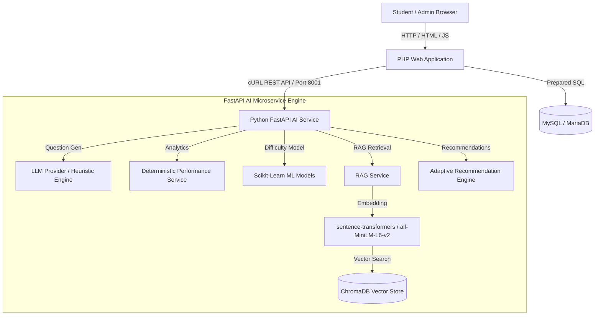

# Platform Architecture Documentation

> [!NOTE]
> **System Architecture**: High-level and component-level technical specification of the Full-Stack Online Examination & AI Engineering Platform (Phases B–H).

---

## 1. System Overview & Component Diagram

---

## 2. Decoupled Component Rationale

| Layer / Service | Responsible Component | Technology | Rationale & Service Boundaries |
| :--- | :--- | :--- | :--- |
| **Web Presentation & Auth** | PHP Backend | PHP 8.1, Apache/Nginx | Owns user sessions, CSRF validation, admin workflows, exam delivery, and server-side scoring. |
| **Relational Data Store** | MySQL / MariaDB | InnoDB Database | Relational engine for core exam records, question banks, student answers, and AI metadata tracking. |
| **AI / ML Microservice** | Python FastAPI | FastAPI, Uvicorn | Stateless microservice executing AI question generation, ML difficulty inference, RAG, and recommendations. |
| **Vector Store** | ChromaDB | Local Persistent DB | Native vector search engine storing 384-dimensional embeddings and metadata for course materials. |

---

## 3. Data Flow & Communication Lifecycle

1. **Authentication & UI Request**: Student logs into PHP application; PHP verifies credentials against MySQL and manages session cookies.
2. **AI Service Invocation**: PHP cURL client (`config/ai_client.php`) dispatches JSON requests to FastAPI (`http://127.0.0.1:8001/api/v1/...`) with API key verification.
3. **Stateless Processing**: FastAPI executes deterministic analytics, ChromaDB vector queries, ML model inference, or LLM prompt completion, returning JSON payloads.
4. **Fallback Tolerance**: If FastAPI is offline or an API key is unconfigured, PHP gracefully handles the response (e.g. falling back to existing assigned difficulty or heuristic practice generation) without crashing.
